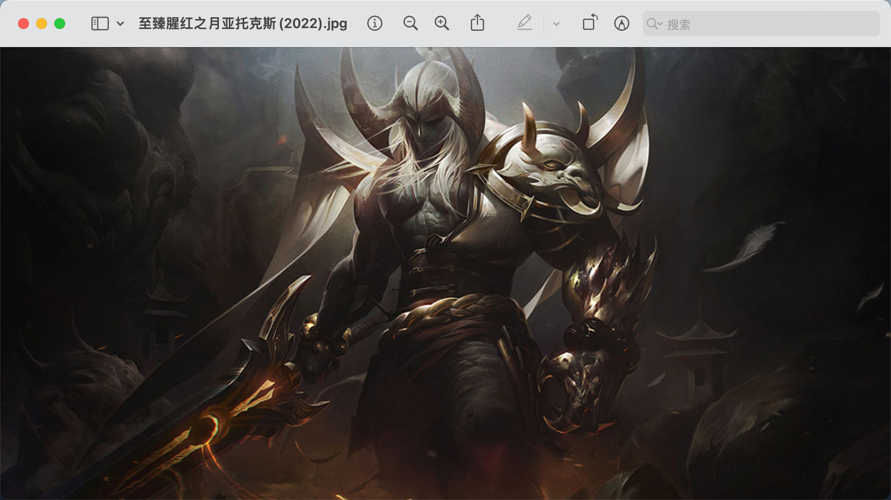

# spider_image_python

- ### 通过脚本爬取壁纸

- ```
  ./spider.py
  ```

- 以英雄联盟为列，获取到的壁纸都是这样的

  

- 可以看到图片很模糊，而且分辨率感人

- 

- 因此我们需要修复图片清晰度，可以利用github上的[waifu2x](https://github.com/nagadomi/waifu2x)进行图片修复

- 使用实列：

- ```
  yuanzhang@YuandeMacBook-Pro waifu2x-ncnn-vulkan-20220728-macos % ./waifu2x-ncnn-vulkan -i 至臻腥红之月亚托克斯\(2022\).jpg -o test.jpg -n 3 -s 8
  [0 Apple M1 Pro]  queueC=0[1]  queueG=0[1]  queueT=0[1]
  [0 Apple M1 Pro]  bugsbn1=0  bugbilz=39  bugcopc=0  bugihfa=0
  [0 Apple M1 Pro]  fp16-p/s/a=1/1/1  int8-p/s/a=1/1/1
  [0 Apple M1 Pro]  subgroup=32  basic=1  vote=1  ballot=1  shuffle=1
  ```

- 打开修复后的图片

- 

- 可以看出清晰度高了很多，并且可以用来做动态壁纸（哎嘿嘿）
